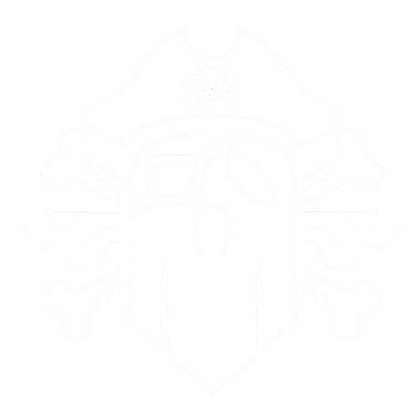

<div align="center">



# 👻 Spectre APT

### *"La liberté est notre code source"*
### *"Freedom is our source code"*

<table><tr>
<td></td>
<td></td>
<td></td>
</tr></table>

</div>


---

## 🎯 Qui sommes-nous ?

**Spectre APT** est un petit groupe / une jeune entreprise de **développement informatique** et de **cybersécurité**.

Nous sommes encore en phase d'apprentissage et d'évolution, mais nous développons des projets variés pour progresser, expérimenter et construire des choses concrètes.

### Notre mission
Apprendre ensemble, développer des projets intéressants, progresser en programmation et en sécurité informatique, et construire petit à petit des projets plus solides.

---

## 👥 L'équipe

<table>
  <tr>
    <td align="center">
      <a href="https://github.com/m0bley-git">
        <br />
        <sub><b>m0bley-git</b></sub>
      </a>
    </td>
    <td align="center">
      <a href="https://github.com/jr534">
        <br />
        <sub><b>jr534</b></sub>
      </a>
    </td>
    <td align="center">
      <a href="https://github.com/Dexort">
        <br />
        <sub><b>Dexort</b></sub>
      </a>
    </td>
  </tr>
</table>

---

## 💻 Notre Stack Technique

<table>
  <tr>
    <td align="center" width="200"><b>Langages</b></td>
    <td></td>
  </tr>
  <tr>
    <td align="center"><b>Systèmes</b></td>
    <td></td>
  </tr>
  <tr>
    <td align="center"><b>Outils</b></td>
    <td></td>
  </tr>
</table>

---

## 🚀 Nos domaines

```
🔐 Cybersécurité    💻 Développement    🌐 Infrastructure    📚 Apprentissage
```

---

## 📌 État actuel

> ⚠️ **Spectre APT est en développement actif**
> 
> Nos projets peuvent être expérimentaux, incomplets ou en évolution constante.
> Nous apprenons et progressons jour après jour ! 🌱

---

<div align="center">

**Made with 💀 by Spectre APT**

</div>
